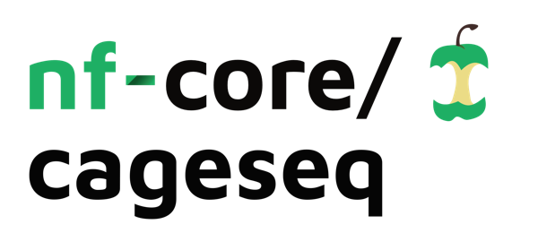

<h1>
  <picture>
    <source media="(prefers-color-scheme: dark)" srcset="docs/images/nf-core-cageseq_logo_dark.png">
    
  </picture>
</h1>

[](https://github.com/codespaces/new/nf-core/cageseq)
[](https://github.com/nf-core/cageseq/actions/workflows/nf-test.yml)
[](https://github.com/nf-core/cageseq/actions/workflows/linting.yml)[](https://nf-co.re/cageseq/results)[](https://doi.org/10.5281/zenodo.XXXXXXX)
[](https://www.nf-test.com)

[](https://www.nextflow.io/)
[](https://github.com/nf-core/tools/releases/tag/4.0.2)
[](https://docs.conda.io/en/latest/)
[](https://www.docker.com/)
[](https://sylabs.io/docs/)
[](https://cloud.seqera.io/launch?pipeline=https://github.com/nf-core/cageseq)

[](https://nfcore.slack.com/channels/cageseq)[](https://bsky.app/profile/nf-co.re)[](https://mstdn.science/@nf_core)[](https://www.youtube.com/c/nf-core)

**nf-core/cageseq** is a bioinformatics pipeline for CAGE-sequencing analysis with trimming, alignment, clustering and counting of CAGE tags.

## Map

The first part of the pipeline is shown here:


The second part of the pipeline is shown here:


## Pipeline overview

> [!NOTE]
> If you are new to Nextflow and nf-core, please refer to [this page](https://nf-co.re/docs/get_started/environment_setup/overview) on how to set-up Nextflow. Make sure to [test your setup](https://nf-co.re/docs/get_started/run-your-first-pipeline) with `-profile test` before running the workflow on actual data.

The pipeline is built using [Nextflow](https://www.nextflow.io/) and processes data using the following steps:

- Merge per-lane FASTQ files with the [`nf-core/cat_fastq`](https://nf-co.re/modules/cat_fastq) module.
- Report raw read quality with [`FastQC`](https://www.bioinformatics.babraham.ac.uk/projects/fastqc/).
- (optional) remove reads that DO NOT start with G.
- Trim adapters with [`TrimGalore`](https://github.com/FelixKrueger/TrimGalore/blob/master/Docs/Trim_Galore_User_Guide.md).
- Report trimmed read quality with [`FastQC`](https://www.bioinformatics.babraham.ac.uk/projects/fastqc/)
- (optional; done by default) Trim the first `G` in forward reads with [`cutadapt`](https://cutadapt.readthedocs.io/en/stable/).
- (optional) Build a [`STAR`](https://github.com/alexdobin/STAR) or [`bowtie2`](https://bowtie-bio.sourceforge.net/bowtie2/manual.shtml) index of the reference genome FASTA file, if the index is not provided. For the `STAR` index, use a mandatory genome annotation in a GTF format.
- Map trimmed reads onto the genome and filter alignments. If using `STAR`, then retain only the reads with at most 2 alignments (done within the `STAR` alignment module); if using `bowtie2`, then retain only the reads with $MAPQ\geq 20$ with [`samtools view`](https://www.htslib.org/doc/samtools-view.html).
- Convert wigs to bigWigs using [`UCSC wigtobigwig`](https://nf-co.re/modules/ucsc_wigtobigwig) module.
- (optional) Remove PCR and optical duplicate reads with [`samtools markdup`](https://www.htslib.org/doc/samtools-markdup.html). See below for details.
- Sort the obtained BAM files using [`samtools sort`](https://www.htslib.org/doc/samtools-sort.html).
- Index the sorted BAM files with [`samtools index`](https://www.htslib.org/doc/samtools-index.html).
- Assess mapping quality using [`samtools stats`](https://www.htslib.org/doc/samtools-stats.html), [`samtools flagstat`](https://www.htslib.org/doc/samtools-flagstat.html) and [`samtools idxstats`](https://www.htslib.org/doc/samtools-idxstats.html).
- [MultiQC](#multiqc) - Aggregate report describing results and QC from the mapping part of the pipeline
- Create a [BSgenome package](https://bioconductor.org/packages/release/bioc/html/BSgenome.html) for the reference genome, if the package is not available.
- Create a CAGEexp object and call TSSs with [`CAGEr`](https://bioconductor.org/packages/release/bioc/html/CAGEr.html) using a [BSgenome package](https://bioconductor.org/packages/release/bioc/html/BSgenome.html) for the respective genome. If reads were mapped with `STAR`, bigWig files to use as input for `CAGEr`; if reads were mapped with `bowtie2`, then use MAPQ-filtered and sorted BAM files as `CAGEr` input.
- Analysis of CAGE reads according to the manual of [`CAGEr`](https://www.bioconductor.org/packages/release/bioc/vignettes/CAGEr/inst/doc/CAGEexp.html). Final output is a markdown document summarizing the results and QC, as well as tracks: bed and bigwig files, a set of intermediate RDS files, stand-alone plots (all shown or referenced in the report), and data tables.
- [Pipeline information](#pipeline-information) - Report metrics generated during the workflow execution

## Usage and Outputs

### Quickstart

```csv
sample,fastq_1,fastq_2
CONTROL_REP1,AEG588A1_S1_L002_R1_001.fastq.gz,AEG588A1_S1_L002_R2_001.fastq.gz
```

Each row represents a fastq file (single-end) or a pair of fastq files (paired end).

Now, you can run the pipeline using:

```bash
nextflow run nf-core/cageseq \
   -profile <docker/singularity/.../institute> \
   --input samplesheet.csv \
   --gtf example.gtf \
   --outdir <OUTDIR>
```

> [!WARNING]
> Please provide pipeline parameters via the CLI or Nextflow `-params-file` option. Custom config files including those provided by the `-c` Nextflow option can be used to provide any configuration _**except for parameters**_; see [docs](https://nf-co.re/docs/running/run-pipelines#using-parameter-files).

For extended documentation about the input parameters and usage, please visit [the usage documentation](docs/usage.md). About outputs you can read at [the outputs page](docs/output.md).

## Credits

**nf-core/cageseq** v2 has been developed by Sviatoslav Sidorov ([@sidorov-si](https://github.com/sidorov-si)), Katalin Ferenc ([@ferenckata](https://github.com/ferenckata)), Damir Baranasic ([@da-bar](https://github.com/da-bar)), Elena Gómez-Marín ([@ElenaGoMa](https://github.com/ElenaGoMa)), and Pavel Nikitin ([@nikitin-p](https://github.com/nikitin-p)). The original version was written by written by Kevin Menden ([@KevinMenden](https://github.com/KevinMenden)) and Tristan Kast ([@TrisKast](https://github.com/TrisKast)) and updated by Matthias Hörtenhuber ([@mashehu](https://github.com/mashehu)).

## Contributions and Support

If you would like to contribute to this pipeline, please see the [contributing guidelines](docs/CONTRIBUTING.md).

For further information or help, don't hesitate to get in touch on the [Slack `#cageseq` channel](https://nfcore.slack.com/channels/cageseq) (you can join with [this invite](https://nf-co.re/join/slack)).

## Citations

If you use nf-core/cageseq for your analysis, please cite it using the following doi: [10.5281/zenodo.4438036](https://doi.org/10.5281/zenodo.4438036)

An extensive list of references for the tools used by the pipeline can be found in the [`CITATIONS.md`](CITATIONS.md) file.

This pipeline uses code and infrastructure developed and maintained by the [nf-core](https://nf-co.re) community, reused here under the [MIT license](https://github.com/nf-core/tools/blob/main/LICENSE).

> **The nf-core framework for community-curated bioinformatics pipelines.**
>
> Philip Ewels, Alexander Peltzer, Sven Fillinger, Harshil Patel, Johannes Alneberg, Andreas Wilm, Maxime Ulysse Garcia, Paolo Di Tommaso & Sven Nahnsen.
>
> _Nat Biotechnol._ 2020 Feb 13. doi: [10.1038/s41587-020-0439-x](https://dx.doi.org/10.1038/s41587-020-0439-x).
