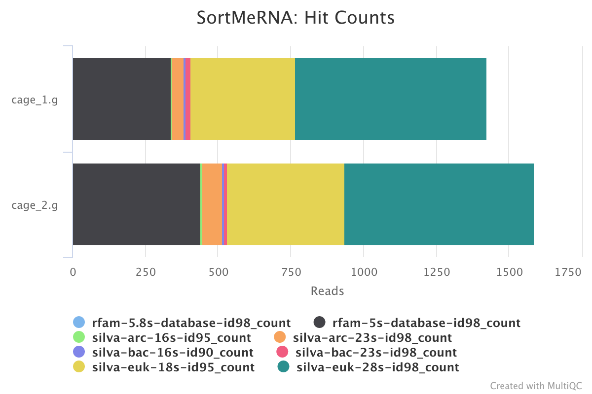
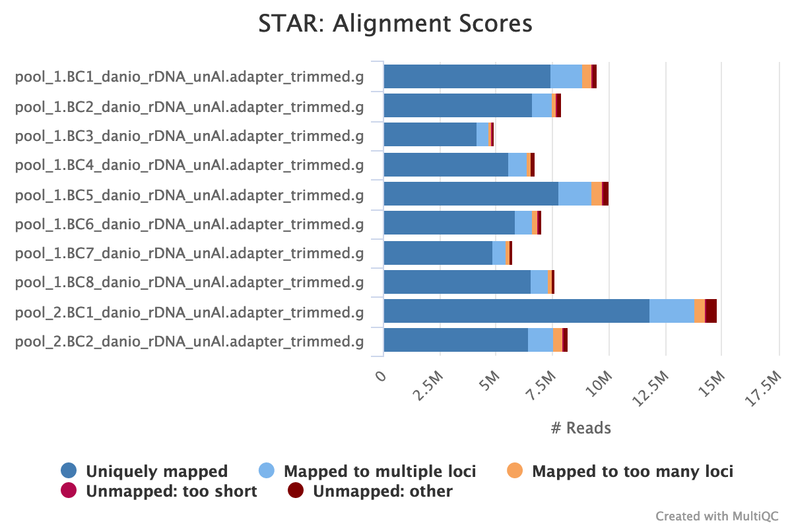
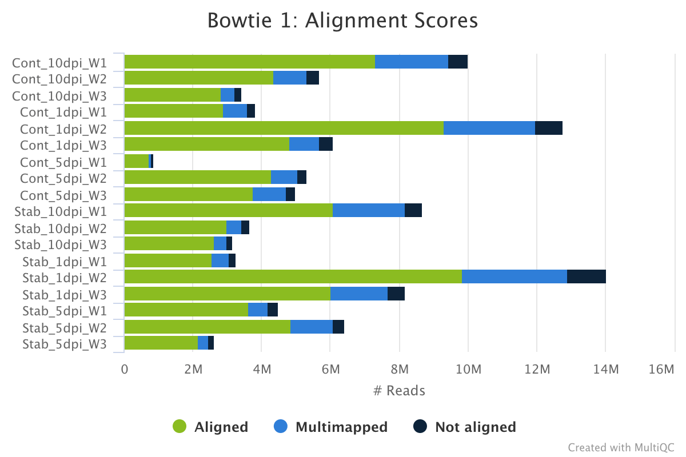
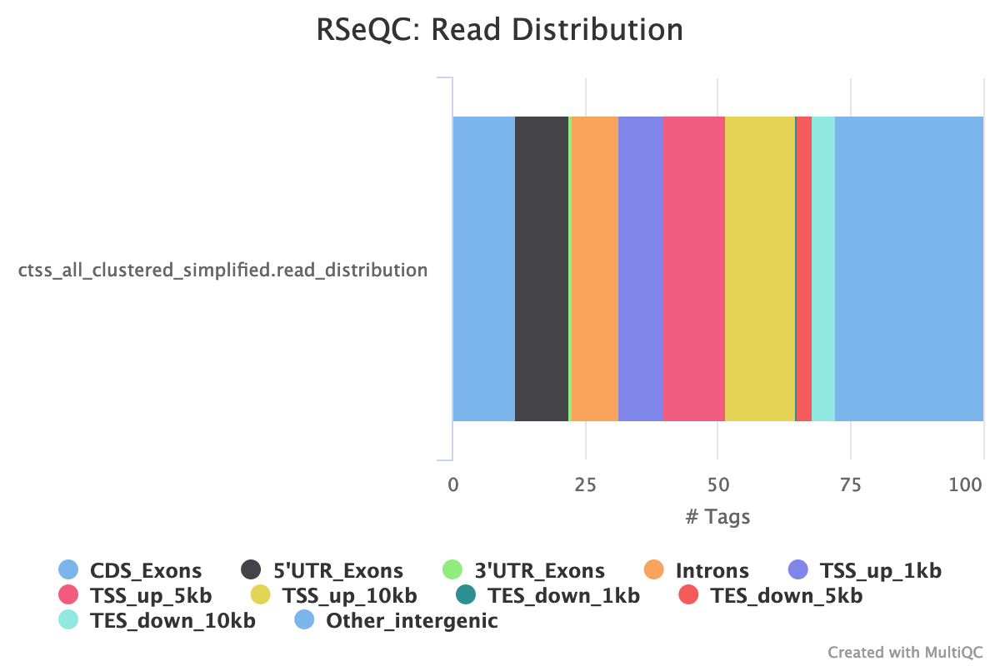

# nf-core/cageseq: Output

## Introduction

This document describes the output produced by the pipeline. Most of the plots are taken from the MultiQC report, which summarises results at the end of the pipeline.

The directories listed below will be created in the results directory after the pipeline has finished. All paths are relative to the top-level results directory.

## Pipeline overview

The pipeline is built using [Nextflow](https://www.nextflow.io/)
and processes data using the following steps:

## 1. Raw read QC

[FastQC](http://www.bioinformatics.babraham.ac.uk/projects/fastqc/) gives general quality metrics about your sequenced reads. It provides information about the quality score distribution across your reads, per base sequence content (%A/T/G/C), adapter contamination and overrepresented sequences.

For further reading and documentation see the [FastQC help pages](http://www.bioinformatics.babraham.ac.uk/projects/fastqc/Help/).

This step can be skipped via `--skip_initial_fastqc`.

  > **NB:** The FastQC plots displayed in the MultiQC report shows _untrimmed_ as reads. They may contain adapter sequence and potentially regions with low quality. In parallel it also shows the FastQC results for the trimmed reads (marked with the suffix `.g`) To see how your reads look after trimming, look at the FastQC reports in the `trimmed/` directory.

**Output directory : `results/fastqc`**

* `*_fastqc.html`: FastQC report containing quality metrics for your untrimmed raw fastq files.
* `zips/`
  * `*_fastqc.zip`: Zip archive containing the FastQC report, tab-delimited data file and plot images.

## 2. Trimming

[Cutadapt](https://cutadapt.readthedocs.io/en/stable/) finds and removes adapter
sequences, primers, poly-A tails and other types of unwanted sequence from your
high-throughput sequencing reads.

By default this pipeline trims the cut enzyme binding site at the 5'-end and
linkers at the 3'-end (can be disabled by setting `--trim_ecop` or `--trim_linkers to false`).
Furthermore, to combat the leading-G-bias of CAGE-seq, G's at the 5'-end are removed. Additional artifacts generated in the sequencing process, can be removed via the `--trim_artifacts` parameter.

All the following trimming process are skipped if `--skip_trimming` is supplied and the fastq files below are only available if '--save_trimmed' is supplied.

**Output directory: `results/trimmed`**

* `adapter_trimmed/sample.adapter_trimmed.fastq.gz`
  * FastQ file after removal of linkers and EcoP15 site.
* `adapter_trimmed/logs/`
  * Trimming report (describes which parameters were used)
* if `--trim_5g`:
  * `g_trimmed/sample.g_trimmed.fastq.gz`
    * 5' G-corrected FastQ file
  * `g_trimmed/logs/`
    * Trimming report (describes which parameters were used)
* if `--trim_artifacts`:
  * `artifacts_trimmed/sample.artifact_trimmed.fastq.gz`
    * FastQ file after artifact removal
  * `artifacts_trimmed/logs/`
    * Trimming report (describes which parameters were used)

## 3. Ribomosal RNA removal

[SortMeRNA](http://bioinfo.lifl.fr/RNA/sortmerna/) is a program for filtering, mapping and OTU-picking NGS reads in metatranscriptomic and metagenomic data.

The MultiQC report shows the overall percentage of rRNA in the sample in the general statistics section. The SortMeRNA section shows a bar plot of the filtered rRNA types.

**Output directory : `results/SortMeRNA/`**

* `logs/`
  * ribosomal RNA mapping reports (describes which parameters were used)

## 4. Alignment

The reads are aligned either with STAR or with bowtie, set via `--aligner`.

### STAR

STAR is a read aligner designed for RNA sequencing. STAR stands for Spliced Transcripts Alignment to a Reference.

The STAR section of the MultiQC report shows a stacked bar plot with alignment rates:
good samples should have most reads as _Uniquely mapped_ and few _Unmapped_ reads.

**Output directory: `results/STAR`**

* `Sample_Aligned.sortedByCoord.out.bam`
  * The aligned BAM file
* `Sample_Log.final.out`
  * The STAR alignment report, contains mapping results summary
* `Sample_Log.out` and `Sample_Log.progress.out`
  * STAR log files, containing a lot of detailed information about the run. Typically only useful for debugging purposes.
* `Sample_SJ.out.tab`
  * Filtered splice junctions detected in the mapping

### Bowtie 1

[Bowtie 1](http://bowtie-bio.sourceforge.net/index.shtml) is an ultrafast,
memory-efficient short read aligner.

The bowtie 1 section of the MultiQC report shows a stacked bar plot with
alignment rates:
good samples should have most reads as _aligned_ and few _Not aligned_ reads.

**Output directory: `results/bowtie`**

* `Sample.bam`
  * The aligned BAM file
* `logs/Sample.out`
  * The bowtie alignment report, contains mapping results summary

## 5. CAGE tag grouping

The custom script `bin/make_ctss.sh` generates a bed file (and a bigWig file with `--bigwig`) for each sample with the summed up 1bp unclustered cage tags.

**Output directory: `results/ctss`**

* `Sample.ctss.bed`
  * A BED6 file with the mapped cage tags
* if `--bigwig`:
  * `Sample.ctss.bw`
    * A bigWig file with the mapped cage tags

## 6. CTSS clustering

### paraclu

[paraclu](http://cbrc3.cbrc.jp/~martin/paraclu/) finds clusters in data
attached to sequences. It is applied on the pool of all ctss bed files to cluster and returns a bed file with the clustered cage-defined transcription start sites (CTSS).

**Output directory: `results/ctss/clusters`**

* `ctss_all_clustered_simplified.bed`
  A BED6 file with the found clusters and their pooled expression as the score.

* `ctss_all_clustered_simplified.bed`
  * A BED6 file with the clustered CTSSs and their pooled counts

## 7. Count table generation

The cage tags are intersected with the clusters identified by
 paraclu and summarized in a count table.

**Output directory: `results/ctss/`**

* `count_table.tsv`:
  * Each column of the count table stands for one sample and each row for one tag cluster. The first row of this table is the header with sample names and the first column contains the tag cluster coordinates.

## 8. QC of results

### RSeQC

RSeQC is a package of scripts designed to evaluate the quality of RNA seq data. You can find out more about the package at the [RSeQC website](http://rseqc.sourceforge.net/).

This pipeline only runs the read destribution RSeQC scripts on the CTSS clusters. The results are summarised within the MultiQC report.

[read_distribution.py](http://rseqc.sourceforge.net/#read-distribution-py)
calculates how mapped reads are distributed over genomic features.

**Output directory : `results/rseqc/read_distribution/`**

* Sample_read_distribution.txt:
  * text file with the raw data describing the distribution of the mapped reads.

### MultiQC

[MultiQC](http://multiqc.info) is a visualization tool that generates a single HTML report summarizing all samples in your project. Most of the pipeline QC results are visualised in the report and further statistics are available in the report data directory.

The pipeline has special steps which also allow the software versions to be reported in the MultiQC output for future traceability.

For more information about how to use MultiQC reports, see [https://multiqc.info](https://multiqc.info).

**Output files:**

* `multiqc/`
  * `multiqc_report.html`: a standalone HTML file that can be viewed in your web browser.
  * `multiqc_data/`: directory containing parsed statistics from the different tools used in the pipeline.
  * `multiqc_plots/`: directory containing static images from the report in various formats.

## Pipeline information

[Nextflow](https://www.nextflow.io/docs/latest/tracing.html) provides excellent functionality for generating various reports relevant to the running and execution of the pipeline. This will allow you to troubleshoot errors with the running of the pipeline, and also provide you with other information such as launch commands, run times and resource usage.

* `pipeline_info/`
  * Reports generated by Nextflow: `execution_report.html`, `execution_timeline.html`, `execution_trace.txt` and `pipeline_dag.dot`/`pipeline_dag.svg`.
  * Reports generated by the pipeline: `pipeline_report.html`, `pipeline_report.txt` and `software_versions.csv`.
  * Documentation for interpretation of results in HTML format: `results_description.html`.
