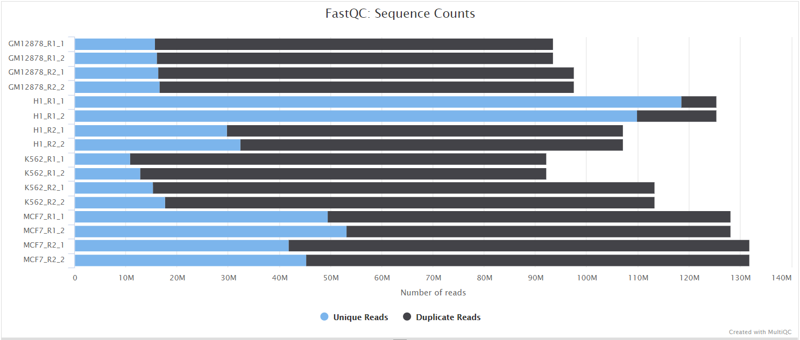
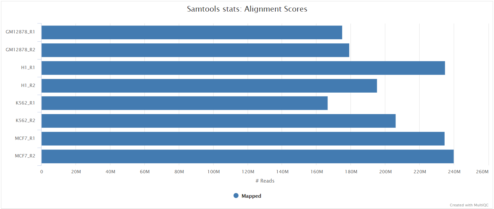
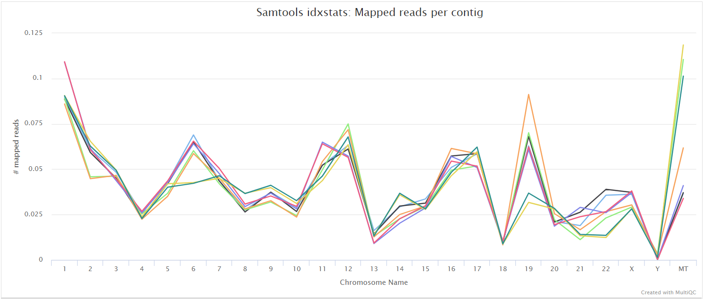

# nf-core/cageseq: Output

## Introduction

This document describes the output produced by the pipeline. Most of the plots are taken from the MultiQC report, which summarises results at the end of the pipeline run.

The directories listed below will be created in the results directory after the pipeline has finished. All paths are relative to the top-level results directory.

## Pipeline overview

The pipeline is built using [Nextflow](https://www.nextflow.io/) and processes data using the following steps:

* [FastQC](#fastqc) - Raw input read QC
* [Trimming](#trimming) - Adapter + EcoP15 + 5'G + artifact fragments removal
* [Ribomosal RNA removal](#ribomosal-rna-removal) - (optional) rRNA filtering
* [trimmed reads FASTQC](#trimed-reads-fastqc) - Read QC after trimming and filtering
* [Alignment](#alignment) - Read alignment to a reference genome
* [CAGE tag identifcation](#cage-tag-grouping) - CAGE tag/CAGE transcription start site (CTSS) identification
* [CAGE tag clustering](#cage-tag-clustering) - CAGE tag clustering
* [QC of tag clusters](#cage-tag-clustering-qc) - read distribution of CAGE tags along the gene models
* [MultiQC](#multiqc) - Aggregate report describing results and QC from the whole pipeline
* [Pipeline information](#pipeline-information) - Report metrics generated during the workflow execution

## 1. FastQC

Output files

* `fastqc/`
    * `*_fastqc.html`: FastQC report containing quality metrics.
    * `*_fastqc.zip`: Zip archive containing the FastQC report, tab-delimited data file and plot images.

[FastQC](http://www.bioinformatics.babraham.ac.uk/projects/fastqc/) gives general quality metrics about your sequenced reads. It provides information about the quality score distribution across your reads, per base sequence content (%A/T/G/C), adapter contamination and overrepresented sequences. For further reading and documentation see the [FastQC help pages](http://www.bioinformatics.babraham.ac.uk/projects/fastqc/Help/).

## 2. Trimming

[Cutadapt](https://cutadapt.readthedocs.io/en/stable/) finds and removes adapter
sequences, primers, poly-A tails and other types of unwanted sequence from your
high-throughput sequencing reads.

By default this pipeline trims the cut enzyme binding site at the 5'-end and
linkers at the 3'-end (can be disabled by setting `--trim_ecop` or `--trim_linkers` to `false`).
Furthermore, to combat the leading-G-bias of CAGE-seq, G's at the 5'-end are removed (disabled by setting `--trim_5g` to `false`). Additional artifacts generated in the sequencing process can be removed via the `--trim_artifacts` parameter (artifact sequence are provided via `--artifacts_5end [path]` and `--artifacts_3end [path]`).

All the following trimming process are skipped if `--skip_trimming` is supplied and the fastq files below are only available if `--save_trimmed` is supplied.

Output files

* `cutadapt/`
    * `cutadapt/logs/`: Trimming reports
    * `cutadapt/reads/`:
        * `*5g.trim.fastq.gz`: 5' G-bias corrected FastQ file.
        * `*adapter.trim.fastq.gz`: FastQ file after removal of linkers and EcoP15 site.
        * `*artifacts.trim.fastq.gz`: FastQ file without artifact sequences.

## 3. Ribomosal RNA removal

[SortMeRNA](http://bioinfo.lifl.fr/RNA/sortmerna/) is a program for filtering, mapping and OTU-picking NGS reads in metatranscriptomic and metagenomic data.

The MultiQC report shows the overall percentage of rRNA in the sample in the general statistics section. The SortMeRNA section shows a bar plot of the filtered rRNA types.

Output files

* `sortmerna/`
    * `sortmerna/logs/`: ribosomal RNA mapping reports

## 4. Trimmed reads FASTQC

Output files

* `fastqc_post/`
    * `*post_fastqc.html`: FastQC report containing quality metrics.
    * `*post_fastqc.zip`: Zip archive containing the FastQC report, tab-delimited data file and plot images.

## 5. Alignment

The reads are aligned either with STAR or with bowtie, set via `--aligner`.

### STAR

STAR is a read aligner designed for RNA sequencing. STAR stands for Spliced Transcripts Alignment to a Reference.

The STAR section of the MultiQC report shows a stacked bar plot with alignment rates:
good samples should have most reads as _Uniquely mapped_ and few _Unmapped_ reads.

Output files

* `star/`
    * `star/star_log`
        * `*.SJ.out.tab`: File containing filtered splice junctions detected after mapping the reads.
        * `*.Log.final.out`: STAR alignment report containing the mapping results summary.
        * `*.Log.out` and `*.Log.progress.out`: STAR log files containing detailed information about the run. Typically only useful for debugging purposes.
    * `star/unmapped/`
        * `*.fastq.gz`: If `--save_unaligned` is specified, FastQ files containing unmapped reads will be placed in this directory.

### Bowtie 1

[Bowtie 1](http://bowtie-bio.sourceforge.net/index.shtml) is an ultrafast,
memory-efficient short read aligner.

The bowtie 1 section of the MultiQC report shows a stacked bar plot with
alignment rates:
good samples should have most reads as _aligned_ and few _Not aligned_ reads.

Output files

* `bowtie/`
    * `bowtie/bowtie_log`
        * `*.out`: The bowtie alignment report, contains mapping results summary
    * `bowtie/unmapped/`
        * `*.fastq.gz`: If `--save_unaligned` is specified, FastQ files containing unmapped reads will be placed in this directory.

### SAMtools

The original BAM files generated by the selected alignment algorithm are further processed with [SAMtools](http://samtools.sourceforge.net/) to sort them by coordinate, for indexing, as well as to generate read mapping statistics. `$ALIGNER` stands either for `star` or `bowtie` depending on the used aligner.

Output files

* `<ALIGNER>/samtools_stats/`
    * SAMtools `<SAMPLE>.sorted.bam.flagstat`, `<SAMPLE>.sorted.bam.idxstats` and `<SAMPLE>.sorted.bam.stats` files generated from the alignment files.

## 6. CAGE tag identification

The aligned reads are converted and grouped to BED files (and bigWig files with `--bigwig`) with 1bp long CAGE tags/transcription start sites (CTSS).

Output files

* `$ALIGNER/ctss`
    * `$ALIGNER/ctss/bed/*.ctss.bed`: A BED6 file with the mapped cage tags
    * `$ALIGNER/ctss/bigwig/*.ctss.bigWig`: A bigWig file with the mapped cage tags

## 7. CAGE tag clustering

### paraclu

[paraclu](http://cbrc3.cbrc.jp/~martin/paraclu/) finds clusters in data
attached to sequences. It is applied on the pool of all ctss bed files to cluster and returns a BED file with the clustered tags. These clusters are then intersected with the BED files and a BED file with counts only in the tag clusters is created for each file. Additionally these counts are summarized in a tab-separated count table, where each row stands for a tag cluster and each column for a sample.

Output files

* `$ALIGNER/tag_clusters`
    * `$ALIGNER/tag_clusters/ctss.clustered.simplified.bed`: A BED6 file with the found tag clusters and their pooled expression as the score.
    * `$ALIGNER/tag_clusters/bed/*.ctss.bed_counts.bed`: A BED6 file with the expression of the tag clusters in this sample.
    * `$ALIGNER/tag_clusters/count_table.tsv`: Each column of the count table stands for one sample and each row for one tag cluster. The first column contains the tag cluster coordinates. The first row of this table is the header with "coordinates" and the sample names.

## 8. QC of tag clusters

### RSeQC

RSeQC is a package of scripts designed to evaluate the quality of RNA seq data. You can find out more about the package at the [RSeQC website](http://rseqc.sourceforge.net/).

This pipeline only runs the [read distribution RSeQC scripts]((http://rseqc.sourceforge.net/#read-distribution-py)) on the tag clusters. These calculate how mapped reads are distributed over genomic features. The results are summarized within the MultiQC report.

## 9. MultiQC

Output files

* `multiqc/`
    * `multiqc_report.html`: a standalone HTML file that can be viewed in your web browser.
    * `multiqc_data/`: directory containing parsed statistics from the different tools used in the pipeline.
    * `multiqc_plots/`: directory containing static images from the report in various formats.

[MultiQC](http://multiqc.info) is a visualization tool that generates a single HTML report summarising all samples in your project. Most of the pipeline QC results are visualised in the report and further statistics are available in the report data directory.

Results generated by MultiQC collate pipeline QC from supported tools e.g. FastQC. The pipeline has special steps which also allow the software versions to be reported in the MultiQC output for future traceability. For more information about how to use MultiQC reports, see <http://multiqc.info>.

## 10. Pipeline information

Output files

* `pipeline_info/`
    * Reports generated by Nextflow: `execution_report.html`, `execution_timeline.html`, `execution_trace.txt` and `pipeline_dag.dot`/`pipeline_dag.svg`.
    * Reports generated by the pipeline: `pipeline_report.html`, `pipeline_report.txt` and `software_versions.yml`. The `pipeline_report*` files will only be present if the `--email` / `--email_on_fail` parameter's are used when running the pipeline.
    * Reformatted samplesheet files used as input to the pipeline: `samplesheet.valid.csv`.

[Nextflow](https://www.nextflow.io/docs/latest/tracing.html) provides excellent functionality for generating various reports relevant to the running and execution of the pipeline. This will allow you to troubleshoot errors with the running of the pipeline, and also provide you with other information such as launch commands, run times and resource usage.
